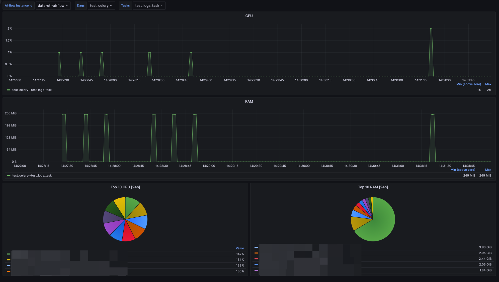

# airflow_custom_metrics_plugin

This plugin adds cpu and ram stats for every tasks in airflow

---

# Custom Metrics Plugin for Apache Airflow

## Overview

The `CustomMetricsPlugin` is an Apache Airflow plugin designed to monitor the CPU and memory usage of tasks in
real-time. This plugin gathers these metrics and pushes them to StatsD, where they can be visualized using monitoring
tools such as Grafana. Also, it prints the metrics to the logs (I'm not sure if it's useful, but it's there :D).

## Features

- **CPU Usage Monitoring**: Tracks and reports the CPU usage of tasks.
- **Memory Usage Monitoring**: Tracks and reports the memory usage of tasks.
- **Automatic Cleanup**: Resets metrics to `0` when tasks are completed, skipped, failed, or deferred.
- **Customizable**: Metrics names are configurable, and the plugin can be enabled/disabled via environment variables.

## Installation

1. **Clone the Repository**:
   ```bash
   git clone https://github.com/khmelevskiy/airflow_custom_metrics_plugin.git
   cd custom-metrics-plugin
   ```

2. **Add the Plugin to Your Airflow Plugins Directory**:
   Copy the `custom_metrics_plugin.py` file into your Airflow plugins directory (usually located at
   `/path/to/airflow/plugins/`).

3. **Configure StatsD**:
   Make sure your Airflow instance is configured to use StatsD. This typically involves setting the following in your
   `airflow.cfg`:

   ```ini
   [metrics]
   statsd_on = True
   statsd_host = localhost
   statsd_port = 8125
   statsd_prefix = airflow
   ```

4. **Enable the Plugin**:
   The plugin can be enabled or disabled using an environment variable. To enable it, set the
   `CUSTOM_METRICS_PLUGIN_ENABLED` environment variable to `true`

5. **Setting 'mappingConfig'** for statsd
   ```
    - match: "*.custom_metrics_cpu_usage_percent.*.*"
      match_metric_type: gauge
      name: "tasks_cpu_usage_percent"
      labels:
        airflow_id: "$1"
        dag_id: "$2"
        task_id: "$3"
    - match: "*.custom_metrics_memory_usage_bytes.*.*"
      match_metric_type: gauge
      name: "tasks_memory_usage_percent"
      labels:
        airflow_id: "$1"
        dag_id: "$2"
        task_id: "$3"
   ```

## Usage

Once the plugin is installed and enabled, it automatically starts monitoring tasks in your Airflow DAGs. The CPU and
memory usage metrics will be sent to StatsD under the following names:

- `tasks_cpu_usage_percent`: The CPU usage percentage of a task.
- `tasks_memory_usage_percent`: The memory usage of a task in bytes.

The metrics are tagged with the following labels:

- `airflow_id`: The ID of the Airflow instance.
- `dag_id`: The ID of the DAG.
- `task_id`: The ID of the task.

### Example Metric Names

Given a DAG with `dag_id="example_dag"` and a task with `task_id="example_task.test"`, the metrics would be named:

- `tasks_cpu_usage_percent.example_dag.example_task__test`
- `tasks_memory_usage_percent.example_dag.example_task__test`

## Configuration

### Environment Variables

- **`CUSTOM_METRICS_PLUGIN_ENABLED`**: Enables or disables the plugin. Set to `true` to enable.
- **`CUSTOM_METRICS_PLUGIN_SLEEP_INTERVAL_SECONDS`**: Controls how often the plugin polls for CPU and memory usage data.
  Default is `1` second.

### Metric Name Customization

The plugin replaces `.` in `dag_id` and `task_id` with `__` to ensure compatibility with monitoring tools that do not
support `.` in metric names.

---

## Example usage in Grafana

### Variables

```
label_values(airflow_id) - airflow_id
label_values(tasks_cpu_usage_percent{airflow_id="$airflow_id"}, dag_id) - dag_id
label_values(tasks_cpu_usage_percent{airflow_id="$airflow_id", dag_id="$dag_id"}, task_id) - task_id

tasks_cpu_usage_percent{airflow_id="$airflow_id", dag_id="$dag_id", task_id="$task_id"} - For dashboard `CPU`
tasks_memory_usage_percent{airflow_id="$airflow_id", dag_id="$dag_id", task_id="$task_id"} - For dashboard `RAM`
topk(10, max_over_time(max by(dag_id, task_id) (tasks_cpu_usage_percent{airflow_id="$airflow_id"})[24h])) - For dashboard `Top 10 CPU [24h]`
topk(10, max_over_time(max by(dag_id, task_id) (tasks_memory_usage_percent{airflow_id="$airflow_id"})[24h])) - For dashboard `Top 10 RAM [24h]`
```

### Dashboard


